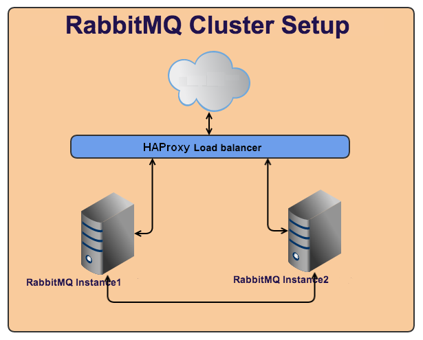
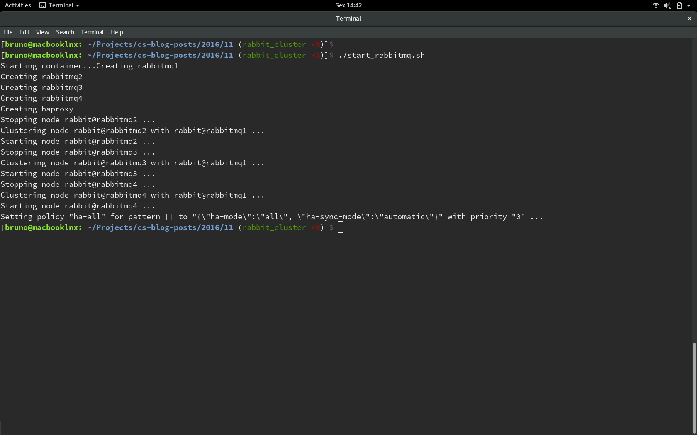
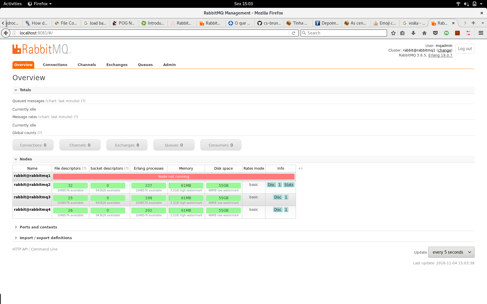

Clusterizando RabbitMQ com Docker Compose
=========================================
A idéia
-------
Olá, vamos falar sobre [RabbitMQ](http://www.rabbitmq.com/)? O [RabbitMQ](http://www.rabbitmq.com/) é um servidor de mensagens feito especialmente para trabalhar com [Advanced Message Queuing Protocol(AMQP)](https://en.wikipedia.org/wiki/Advanced_Message_Queuing_Protocol), um protocolo de comunicação em rede que permite que aplicações se comuniquem.
Sem a utilização de um middleware de mensagens, a integração de sistemas fica muito cara e complexa. O [AMQP](https://en.wikipedia.org/wiki/Advanced_Message_Queuing_Protocol) torna a integração entre vários sistemas diferentes possível e também permite que diferentes produtos que implementem este mesmo protocolo possam trocar informações e isso torna o [AMQP](https://en.wikipedia.org/wiki/Advanced_Message_Queuing_Protocol) um dos pioneiros na evolução de mensageria.

Aqui vamos utilizar [Docker Compose](https://docs.docker.com/compose/) para "subir" 4 instâncias do [RabbitMQ](http://www.rabbitmq.com/) junto com o [HAProxy](http://www.haproxy.org/), um [Load Balancer](https://www.nginx.com/resources/glossary/load-balancing/) para distribuir, eficientemente, o trágefo entre os nós do [RabbitMQ](http://www.rabbitmq.com/).



A idéia é o [HAProxy](http://www.haproxy.org/) receber uma publicação de alguma fila, de alguma exchange e redirecionar para o [RabbitMQ](http://www.rabbitmq.com/), espelhando os dados nos outros nós e caso algum deles falhe, temos os dados nos outros e o próprio [RabbitMQ](http://www.rabbitmq.com/) escolhe outro nó para ser o novo "master".

Mão na massa
------------

Vamos utilizar docker e para funcionar é necessário o docker instalado. [Segue o tutorial](https://docs.docker.com/engine/installation/), verifique qual SO está sendo utilizado e seja feliz. :smile:

É necessário a instalação do docker-compose também. Para instalar é um pouco mais simples que o docker em si. Primeiro, mude para root: `sudo su` :punch:.
Agora digite:
```
curl -L https://github.com/docker/compose/releases/download/1.8.1/docker-compose-`uname -s`-`uname -m` > /usr/local/bin/docker-compose
```
e depois de permissão para o docker-compose
```
chmod +x /usr/local/bin/docker-compose
```
Com tudo instalado, vamos começar a destruir o teclado.  :musical_keyboard:

Vamos começar criando nosso script de subida dos nossos docker's. Crie um arquivo chamado docker-compose.yml: `vim docker-compose.yml`
Agora copie e cole o código abaixo no seu arquivo:
```
version: '2'
services:
  rabbitmq1:
    image: rabbitmq:3-management
    container_name: rabbitmq1
    hostname: rabbitmq1
    ports:
      - "8080:15672"
    network_mode: "bridge"
    volumes:
     - $PWD/storage/rabbitmq1:/var/lib/rabbitmq
    environment:
     - RABBITMQ_ERLANG_COOKIE=This_is_my_secret_phrase
     - RABBITMQ_DEFAULT_USER=mqadmin
     - RABBITMQ_DEFAULT_PASS=Admin123XX_
     - CLUSTERED=true

  rabbitmq2:
    image: rabbitmq:3-management
    container_name: rabbitmq2
    hostname: rabbitmq2
    ports:
      - "8081:15672"
    network_mode: "bridge"
    volumes:
     - $PWD/storage/rabbitmq2:/var/lib/rabbitmq
    environment:
     - RABBITMQ_ERLANG_COOKIE=This_is_my_secret_phrase
     - RABBITMQ_DEFAULT_USER=mqadmin
     - RABBITMQ_DEFAULT_PASS=Admin123XX_
     - CLUSTERED=true
    links:
     - rabbitmq1:rabbitmq1

  rabbitmq3:
    image: rabbitmq:3-management
    container_name: rabbitmq3
    hostname: rabbitmq3
    ports:
      - "8082:15672"
    network_mode: "bridge"
    volumes:
      - $PWD/storage/rabbitmq3:/var/lib/rabbitmq
    environment:
     - RABBITMQ_ERLANG_COOKIE=This_is_my_secret_phrase
     - RABBITMQ_DEFAULT_USER=mqadmin
     - RABBITMQ_DEFAULT_PASS=Admin123XX_
     - CLUSTERED=true
    links:
     - rabbitmq1:rabbitmq1
     - rabbitmq2:rabbitmq2

  rabbitmq4:
    image: rabbitmq:3-management
    container_name: rabbitmq4
    hostname: rabbitmq4
    ports:
      - "8083:15672"
    network_mode: "bridge"
    volumes:
      - $PWD/storage/rabbitmq4:/var/lib/rabbitmq
    environment:
     - RABBITMQ_ERLANG_COOKIE=This_is_my_secret_phrase
     - RABBITMQ_DEFAULT_USER=mqadmin
     - RABBITMQ_DEFAULT_PASS=Admin123XX_
     - CLUSTERED=true
    links:
     - rabbitmq1:rabbitmq1
     - rabbitmq2:rabbitmq2
     - rabbitmq3:rabbitmq3

  haproxy:
    image: haproxy:1.6
    container_name: haproxy
    hostname: haproxy
    ports:
      - 5672:5672
      - 20000:20000
    network_mode: "bridge"
    links:
      - rabbitmq1:rabbitmq1
      - rabbitmq2:rabbitmq2
      - rabbitmq3:rabbitmq3
      - rabbitmq4:rabbitmq4
```
**version: '2'**  :arrow_right: Com isso ja trabalharemos com as novas funcionalidades do docker-compose.

**services:** :arrow_right: Aqui vamos setar todos os serviços que iremos utilizar, todos os docker que irão subir para que nossa aplicação funcione.

**rabbitmq1:** :arrow_right: Nome que daremos para os nossos serviços do [RabbitMQ](http://www.rabbitmq.com/).

**image: rabbitmq:3-management** :arrow_right: Esta é a imagem que usaremos para nosso [RabbitMQ](http://www.rabbitmq.com/).

**container_name: rabbitmq1** :arrow_right: Vamos dar nomes para nossos containers para ficar mais fácil administrá-los.

**hostname: rabbitmq1** :arrow_right: Vamos colocar o nome dos nossos hosts, isso facilitará e muito a nossa clusterização pois sempre que utilizar um `docker exec` os nomes internos dos conteiners serão os mesmos.

**ports: - "8080:15672"** :arrow_right: Com isto poderemos verificar, através do nosso browser, se nosso [RabbitMQ](http://www.rabbitmq.com/) está funcionando: `localhost:8080`.

**network_mode: "bridge"** :arrow_right: Para que nosso cluster funcione, precisamos que todos os nós estejam na mesma "rede", neste caso na `bridge`.

**volumes: - $PWD/storage/rabbitmq1:/var/lib/rabbitmq** :arrow_right: Criação dos volumes que iremos utilizar.

**environment:** :arrow_right: Aqui vamos definir nossas variáveis de ambiente, com o [Docker Compose](https://docs.docker.com/compose/) fica muito mais fácil.

**- RABBITMQ_ERLANG_COOKIE=This_is_my_secret_phrase** :arrow_right: Para utilizar o [RabbitMQ](http://www.rabbitmq.com/), precisamos definir um Erlang Cookie para cada nós se comunicar entre si.

**- RABBITMQ_DEFAULT_USER=mqadmin** :arrow_right: Definimos um usuário para nosso nó.

**- RABBITMQ_DEFAULT_PASS=Admin123XX_** :arrow_right: Definimos uma senha para nosso usuário.

**- CLUSTERED=true** :arrow_right: Isto é apenas para definir que rodaremos em modo cluster.

**- links:** :arrow_right: Com este parâmetro definimos todos os links que nossa aplicação vai fazer.

:point_right: As configurações do [HAProxy](http://www.haproxy.org/) são as mesmas que o [RabbitMQ](http://www.rabbitmq.com/) no docker-compose.

Agora vamos preparar nossa imagem do [HAProxy](http://www.haproxy.org/), poderiamos utilizar a default mas queremos e precisamos alterar o arquivo de configuração dele para atender as nossas necessidades.

Primeiro vamos criar um Dockerfile para fazer uma imagem do [HAProxy](http://www.haproxy.org/) que atenda os nossos requisitos: `vim Dockerfile`

Agora cole no Dockerfile os comandos abaixo:

```
 FROM haproxy:1.6

 ENV HAPROXY_USER haproxy

 RUN groupadd --system ${HAPROXY_USER} && \
   useradd --system --gid ${HAPROXY_USER} ${HAPROXY_USER} && \
   mkdir --parents /var/lib/${HAPROXY_USER} && \
   chown -R ${HAPROXY_USER}:${HAPROXY_USER} /var/lib/${HAPROXY_USER}

 COPY haproxy.cfg /usr/local/etc/haproxy/haproxy.cfg

 CMD ["haproxy", "-db", "-f", "/usr/local/etc/haproxy/haproxy.cfg"]
```

Com esse Dockerfile vai ser criado uma imagem com um usuário haproxy e ja vai copiar nosso arquivo de configuração para dentro dela, ja deixando ela pronta para uso.

No mesmo diretório, vamos criar um arquivo chamado `haproxy.cfg` com o seguinte conteúdo:

```
global
 	  log 127.0.0.1	local0 info
    chroot /var/lib/haproxy
    user haproxy
    group haproxy

listen stats
    bind  *:20000
    mode  http
    stats enable
    stats refresh 3s
    stats uri /
    timeout client 10000
    timeout connect 10000
    timeout server 30000
    #``stats hide-version
    stats auth guest:guest

listen rabbitmq-tcp
    bind    *:5672
    mode    tcp
    log global
 	  retries 4
 	  option tcplog
    option persist
    balance roundrobin
    server  rabbitmq1 rabbitmq1:5672 check inter 5s rise 2 fall 5
    server  rabbitmq2 rabbitmq2:5672 check inter 5s rise 2 fall 5
    server  rabbitmq3 rabbitmq3:5672 check inter 5s rise 2 fall 5
    server  rabbitmq4 rabbitmq4:5672 check inter 5s rise 2 fall 5
```

Essas configurações balancearão nossos nós, checando em um intervalo de 5 segundos se os nós estão online ou não. roundrobin é um algoritmo simples de agendamento de processos, é um mecanismo que equilibra a carga local e distribui entre os nós do cluster. Nossos nós estarão sendo ouvidos e checados pela porta 5672, que é a porta padrão de comunicação TCP do [RabbitMQ](http://www.rabbitmq.com/).

Pronto :exclamation:, ja criamos os arquivos de configuração  :clap:. Agora vamos fazer o build da nossa nova imagem do [HAProxy](http://www.haproxy.org/). No mesmo diretório que criamos o Dockerfile e o haproxy.cfg, digite:

`docker build -t haproxy:1.6 .`

O processo deverá ser algo parecido com isso:


Agora vamos juntar tudo isso :scream:. Calma que tudo vai dar certo  :sweat_smile:. Vamos criar um shell script bem básico para subir tudo de uma vez :heart_eyes:. Nesse mesmo diretório que criamos os outros arquivos, vamos criar um arquivo(prometo que é o último :pray:) com o nome de start_all.sh: `vim start_all.sh` e cole o código abaixo:

```
#!/bin/bash
# "Bruno Luis Cardoso Novo <bruno.novo@concrete.com.br>"
# Script to manage the containers execution

## Variables for images build.
JOIN_RABBIT2_RABBIT1="rabbitmqctl stop_app; rabbitmqctl join_cluster rabbit@rabbitmq1; rabbitmqctl start_app"
JOIN_RABBIT3_RABBIT1="rabbitmqctl stop_app; rabbitmqctl join_cluster rabbit@rabbitmq1; rabbitmqctl start_app"
JOIN_RABBIT4_RABBIT1="rabbitmqctl stop_app; rabbitmqctl join_cluster rabbit@rabbitmq1; rabbitmqctl start_app"
OPTIONAL_COMMAND="rabbitmqctl set_policy ha-all '' '{\"ha-mode\":\"all\", \"ha-sync-mode\":\"automatic\"}'"


#Subindo os container's do rabbitmq
echo -n "Starting container..."
docker-compose down
docker-compose up -d
sleep 15
docker exec -ti rabbitmq2 bash -c "$JOIN_RABBIT2_RABBIT1"
docker exec -ti rabbitmq3 bash -c "$JOIN_RABBIT3_RABBIT1"
docker exec -ti rabbitmq4 bash -c "$JOIN_RABBIT4_RABBIT1"
docker exec -ti rabbitmq1 bash -c "$OPTIONAL_COMMAND"
```

Como estamos utilizando docker-compose fica muito maisl fácil de "subir" um container, ele verifica se ja tem algum rodando e o mata com `docker-compose down`, depois, em modo background(`-d`), ele sobe todos os nossos serviços, um por um. Foi colocado um sleep de 15 segundos para dar tempo de todos eles subirem e ,depois ser feita a ligação entre eles, executar, dentro de cada um dos nossos containers do [RabbitMQ](http://www.rabbitmq.com/), os comandos para os nós se juntarem ao cluster.Logo após isso foi colocado um OPTIONAL_COMMAND para definirmos uma política para nosso cluster.

:warning: No caso da política, foi definido que o cluster funcionará em modo mirror, todos os nós terão as mesmas informações. Dependendo do tipo de cluster que sua aplicação necessite, o tipo de política pode ser alterado sem problemas.  :grin:

Dê permissão à ele: `chmod +x start_all.sh`

E execute: `./start_all.sh`

Com isso vamos poder ver algo parecido com isso:



Para verificarmos se tudo subiu como planejado, vamos digitar: `docker ps`


Podemos abrir o browser e digitar: `localhost:8080`, por exemplo, e veremos a tela de login do [RabbitMQ](http://www.rabbitmq.com/), digite o usuário e a senha que configuramos e Voalá:


Aleluia irmãos  :raised_hands:! Tudo funcionando a pleno vapor, mas e se tivermos algum problema em algum dos nós? E se algum deles cair? Vamos fazer um teste  :smiling_imp:, vamos parar um dos nós e verificar como o [RabbitMQ](http://www.rabbitmq.com/) vai se comportar. Volte para o terminal e digite: `docker stop rabbitmq1`

Quando voltamos para o browser, não conseguimos mais ver a página do [RabbitMQ](http://www.rabbitmq.com/) porquê paramos ele. Ao invés de utilizar a porta `8080`, vamos alterar para `8081` que é a porta do `rabbitmq2` que configuramos no docker-compose.



Podemos verificar que o `rabbitmq1` que paramos está off mas o próprio [RabbitMQ](http://www.rabbitmq.com/) ja verificou que ele está off e já promoveu um novo nó para ser nosso "master" e continuarem seu funcionamento.

Para retornar o `rabbitmq1` de volta das cinzas é só digitar: `docker start rabbitmq1` e pronto. Tudo de volta a normalidade.

Uma outra maneira de ficarmos de olho :eyes: nos rabbit's é utilizar o painel do [HAProxy](http://www.haproxy.org/): `localhost:20000`


Link's interessantes
-----------

Bom pessoal, é isso. Essa foi uma maneira mais simples de subirmos um [RabbitMQ](http://www.rabbitmq.com/) e começarmos a utilizá-lo nas nossas futuras aplicações. Se quiser se aprofundar ainda mais no assunto existem vários link's bem interessantes e que darão uma visão bem mais técnica de sua utilização.

https://www.rabbitmq.com/

http://www.concretesolutions.com.br/2012/01/26/rabbitmq-conceitos-basicos/

http://www.devmedia.com.br/introducao-ao-amqp-com-rabbitmq/33036

http://www.pognao.com.br/2013/04/rabbitmq.html

https://www.portalgsti.com.br/rabbitmq/sobre/

Agradecimento
-------

Obrigado pelo tempo que disponibilizou para ler este artigo e qualquer dúvida é só chamar.
